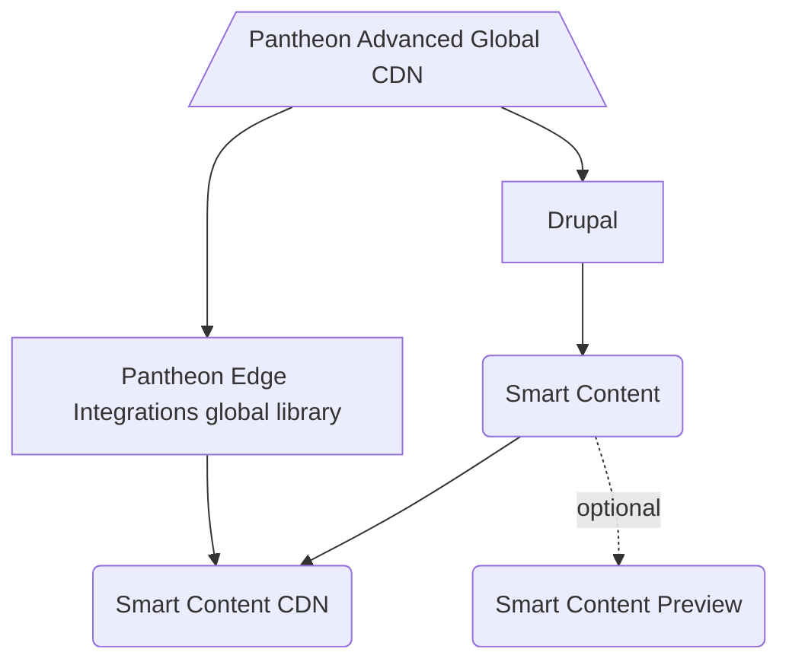

# Pantheon Edge Integrations Drupal SDK

[](https://pantheon.io/docs/oss-support-levels#unsupported)  

Welcome to the Pantheon Edge Integrations Drupal SDK!

This repository serves as a one-stop shop for integrating your Drupal site on Pantheon with our Edge Integrations toolset.

## Architecture

The diagram below illustrates the general overview of what this SDK provides and how the pieces fit together.



### Description

The Edge Integrations WordPress SDK is made up of several components that, in addition to the documentation stored in this repository, are all installed automatically when you `composer require` the project in your WordPress project root. 

#### Pantheon Advanced Global CDN
Edge Integrations start with the "edge" itself, the CDN layer that is the last stop before a page is rendered in your browser. Pantheon's [Advanced Global CDN](https://pantheon.io/docs/guides/professional-services/advanced-global-cdn) has enabled Varnish configuration rules on our AGCDN platform to allow for geolocation information and interest tracking data to be sent back and forth with the CDN, enabling CDN caching for content personalized by those parameters. AGCDN is the first step for Pantheon Edge Integrations and allows us to render cached versions of personalized pages.

#### Pantheon Edge Integrations global library
The [Pantheon Edge Integrations](https://github.com/pantheon-systems/pantheon-edge-integrations) global library allows developers to interact with the header data sent to and from the CDN. This is a low level interface that simplifies the process of communicating with and interpretting headers sent from the CDN. It's important to note that the Edge Integrations library is built as a generic, CMS-agnostic PHP package, and is used as the base of both the WordPress and the Drupal implementations.

#### Smart Content
[Smart Content](https://www.drupal.org/project/smart_content) is used to provide an easy-to-use interface to manage personalized content in Drupal. The Smart Content CDN module extends Smart Content to store config options for managing your personalized content.

#### Smart Content CDN
[Smart Content CDN](https:github.com/pantheon-systems/smart_content_cdn) uses the interfaces provided by Smart Content as well as the interactions enabled by the Pantheon Edge Integrations library to handle the two-way communication between the CDN and the CMS to render personalized content or set/get interest values.

#### Smart Content Preview
Smart Content Preview allows blocks created with Smart Content to be previewed and tested. In this case, this allows the site administrator to preview geolocation- or interest-based content on the front-end. This module is currently still in development.

## Setup

Adding Edge Integrations support to your project is simple.

<!-- Dev note: This isn't actually possible yet until we publish this repository on Packagist. -->

To get started, all you need to do is to add this repository as a dependency:

```bash
composer require pantheon-systems/edge-integrations-drupal-sdk
```

That command will add this repository to your `/vendor` directory, as well as all of the dependencies, which include a [global, CMS-agnostic PHP library](https://github.com/pantheon-systems/pantheon-edge-integrations) and a [Drupal module](https://github.com/pantheon-systems/smart_content_cdn) as well as all of the documentation for the SDK.

