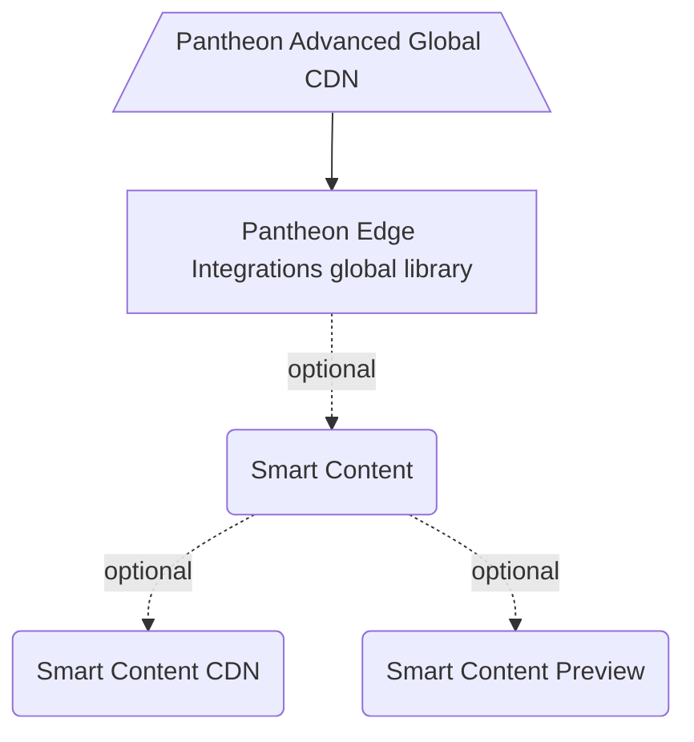

# Pantheon Edge Integrations Drupal SDK

## Archived project
This project is **archived** as of August 2024 as it no longer receives active development.
The architecture provided by the tools in this SDK and the related projects are still valid and will continue to work on Pantheon AGCDN. However, we will not be responding to issues or pull requests or building these tools out more than they are already.

[](https://docs.pantheon.io/oss-support-levels#deprecated)  

Welcome to the Pantheon Edge Integrations Drupal SDK!

This repository serves as a one-stop shop for integrating your Drupal site on Pantheon with our Edge Integrations toolset.

## Architecture

The diagram below illustrates the general overview of what this SDK provides and how the pieces fit together.



### Description

The Edge Integrations Drupal SDK is made up of several components that, in addition to the documentation stored in this repository, are all installed automatically when you `composer require` the project in your Drupal project root. 

#### Pantheon Advanced Global CDN
Edge Integrations start with the "edge" itself, the CDN layer that is the last stop before a page is rendered in your browser. Pantheon's [Advanced Global CDN](https://pantheon.io/docs/guides/professional-services/advanced-global-cdn) has enabled Varnish configuration rules on our AGCDN platform to allow for geolocation information and interest tracking data to be sent back and forth with the CDN, enabling CDN caching for content personalized by those parameters. AGCDN is the first step for Pantheon Edge Integrations and allows us to render cached versions of personalized pages.

#### Pantheon Edge Integrations global library
The [Pantheon Edge Integrations](https://github.com/pantheon-systems/pantheon-edge-integrations) global library allows developers to interact with the header data sent to and from the CDN. This is a low level interface that simplifies the process of communicating with and interpretting headers sent from the CDN. It's important to note that the Edge Integrations library is built as a generic, CMS-agnostic PHP package, and is used as the base of both the WordPress and the Drupal implementations.

#### Smart Content CDN
[Smart Content CDN](https://github.com/pantheon-systems/smart_content_cdn) uses interfaces provided by [Smart Content](https://www.drupal.org/project/smart_content) as well as the interactions with header data enabled by the Pantheon Edge Integrations library to handle the two-way communication between the CDN and the CMS to render personalized content by geolocation or interest.

#### Smart Content Preview
[Smart Content Preview](https://www.drupal.org/project/smart_content_preview) allows blocks created with Smart Content to be previewed and tested. In this case, this allows the site administrator to preview geolocation- or interest-based content on the front-end. This module is currently still in development.

## Setup

Adding Edge Integrations support to your project is simple.

To get started, all you need to do is to add this repository as a dependency:

```bash
composer require pantheon-systems/edge-integrations-drupal-sdk
```

That command will add this repository with all of the associated documentation to your `/vendor` directory, as well the [global, CMS-agnostic PHP library](https://github.com/pantheon-systems/pantheon-edge-integrations) so you can get started right away.

In addition, Composer suggests the [Smart Content CDN](https://github.com/pantheon-systems/smart_content_cdn) as a possible implementation for Drupal personalization.

You can also use Composer to require these packages separately (e.g. `composer require pantheon-systems/smart-content-cdn` or `composer require pantheon-systems/pantheon-edge-integrations`) if you don't need the documentation locally.

## Known Issues

There is a known conflict with the [Internal Page Cache](https://www.drupal.org/docs/administering-a-drupal-site/internal-page-cache) module. This module does not provide any benefit when used on a Pantheon environment but may be recommended (or enabled) for some modules. Our recommendation is to disable the Internal Page Cache module on Pantheon to ensure compatibility with Edge Integrations. [Dynamic Page Cache](https://www.drupal.org/docs/8/core/modules/dynamic-page-cache/overview) _is_ compatible with Edge Integrations and does not suffer from the same restrictions.
