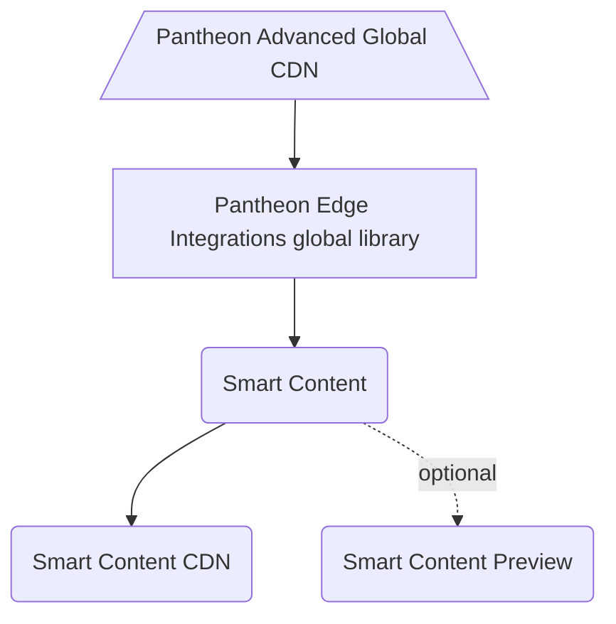

# Pantheon Edge Integrations Drupal SDK

[](https://github.com/topics/unsupported?q=org%3Apantheon-systems "Unsupported, e.g. a tool we are actively using internally and are making available, but do not promise to support")

Welcome to the Pantheon Edge Integrations Drupal SDK!

This repository serves as a one-stop shop for integrating your Drupal site on Pantheon with our Edge Integrations toolset.

## Architecture

The diagram below illustrates the general overview of what this SDK provides and how the pieces fit together.


<!--
### Description

The Edge Integrations WordPress SDK is made up of several components that, in addition to the documentation stored in this repository, are all installed automatically when you `composer require` the project in your WordPress project root. 

#### Pantheon Advanced Global CDN
Edge Integrations start with the "edge" itself, the CDN layer that is the last stop before a page is rendered in your browser. Pantheon's [Advanced Global CDN](https://pantheon.io/docs/guides/professional-services/advanced-global-cdn) has enabled Varnish configuration rules on our AGCDN platform to allow for geolocation information and interest tracking data to be sent back and forth with the CDN, enabling CDN caching for content personalized by those parameters. AGCDN is the first step for Pantheon Edge Integrations and allows us to render cached versions of personalized pages.

#### Pantheon Edge Integrations global library
The [Pantheon Edge Integrations](https://github.com/pantheon-systems/pantheon-edge-integrations) global library allows developers to interact with the header data sent to and from the CDN. This is a low level interface that simplifies the process of communicating with and interpretting headers sent from the CDN. It's important to note that the Edge Integrations library is built as a generic, CMS-agnostic PHP package, and is used as the base of both the WordPress and the Drupal implementations.

#### Pantheon WordPress Edge Integrations plugin
The [WordPress Edge Integrations](https://github.com/pantheon-systems/pantheon-wordpress-edge-integrations) plugin adds namespaced functions (e.g. `Pantheon\EI\WP\get_geo()` and `Pantheon\EI\WP\get_interest()`), hooks and filters that can empower WordPress developers to use our edge integrations for personalization without directly interfacing with the global library. It includes opinionated helper functions that guide the parameters and return values of our functions as well as implements interest tracking based on post categories (by default).
-->
## Setup

Adding Edge Integrations support to your project is simple.

<!-- Dev note: This isn't actually possible yet until we publish this repository on Packagist. -->

To get started, all you need to do is to add this repository as a dependency:

```bash
composer require pantheon-systems/edge-integrations-drupal-sdk
```

That command will add this repository to your `/vendor` directory, as well as all of the dependencies, which include a [global, CMS-agnostic PHP library](https://github.com/pantheon-systems/pantheon-edge-integrations) and a [Drupal module](https://github.com/pantheon-systems/smart_content_cdn) as well as all of the documentation for the SDK.

